<h1 align="center">$$\color{#a5a5a5} \Huge \text{نحوه‌ی استفاده و تنظیمات پنل}$$ </h1>

<p align="center">
  <br>

<h2>$$\color{#a5a5a5} \Large \text{جدول مطالب}$$</h2>

1. [سابسکریپشن Normal](#سابسکریپشن-normal)
2. [سابسکریپشن Full Normal](#سابسکریپشن-full-normal)
3. [سابسکریپشن Fragment](#سابسکریپشن-fragment)
   - 3.1 [سابسکریپشن Fragment برای xray](#سابسکریپشن-fragment-برای-xray)
   - 3.2 [سابسکریپشن Fragment برای Hiddify](#سابسکریپشن-fragment-برای-hiddify)
4. [سابسکریپشن Warp](#سابسکریپشن-warp)
5. [سابسکریپشن Warp PRO](#سابسکریپشن-warp-pro)
6. [تنظیمات پیشرفته](#تنظیمات-پیشرفته)
7. [تنظیمات VLESS/TROJAN](#تنظیمات-vlesstrojan)
   - 7.1 [سرورهای DNS](#سرورهای-dns)
   - 7.2 [تنظیمات ProxyIP](#تنظیمات-proxyip)
   - 7.3 [تنظیمات Chain Proxy](#تنظیمات-chain-proxy)
   - 7.4 [تنظیمات IP تمیز](#تنظیمات-ip-تمیز)
   - 7.5 [فعال کردن IPv6](#فعال-کردن-ipv6)
   - 7.6 [تنظیمات Custom CDN](#تنظیمات-custom-cdn)
   - 7.7 [زمان چک کردن Best Ping](#زمان-چک-کردن-best-ping)
   - 7.8 [انتخاب Protocol](#انتخاب-protocol)
   - 7.9 [انتخاب Port](#انتخاب-port)
8. [تنظیمات Fragment](#تنظیمات-fragment)
9. [تنظیمات WARP GENERAL](#تنظیمات-warp-general)
10. [تنظیمات WARP PRO](#تنظیمات-warp-pro)
11. [تنظیمات Routing Rules](#تنظیمات-routing-rules)

<br><br>

فرض کنید اسم worker یا pages شما هست `worker-polished-leaf-d022`:


شما میتونید Panel رو با اضافه کردن `panel/` انتهاش مثل زیر ببینید:

>`https://worker-polished-leaf-d022.workers.dev/panel`


ازتون میخواد پسورد جدید بذارید و لاگین کنید و تمام.
> [!IMPORTANT]
> پسورد باید حداقل **8 کاراکتر** باشه و حداقل یه **حرف بزرگ** و یه **عدد** هم توش باشه. برای دفعات بعدی از پایین پنل هم میتونید پسورد رو عوض کنید.
حالا بریم بخشای مختلف پنل رو بررسی کنیم:
<br><br>


## سابسکریپشن Normal <a id="سابسکریپشن-normal"></a>
<p align="center">
  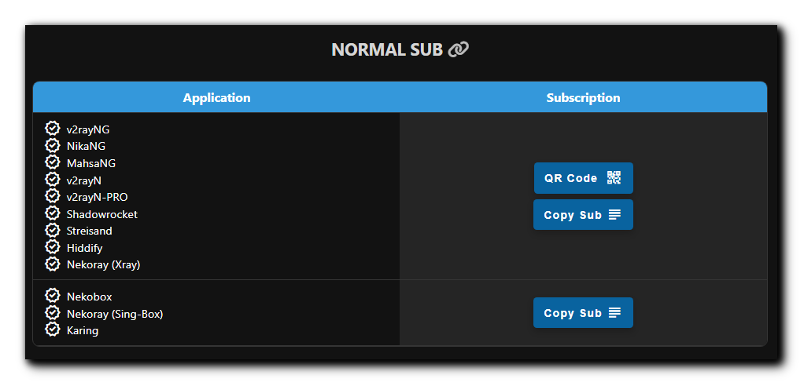
</p>

از این بخش شروع کردم چون خیلیا دوست دارن بدون فرگمنت یا تنظیمات پنل استفاده کنن، ولی حواستون باشه باید خودتون بلد باشید روی اپلیکیشن‌ها تنظیم کنید وگرنه امکان داره به مشکل بخورید. توصیه میکنم از ساب‌های `Full Normal` استفاده کنید چون تمام تنظیمات پنل روشون اعمال شده و نیازی نیست کار خاصی بکنید. توجه داشته باشید Routing Rules یا Chain Proxy و تنظیمات DNS پنل روی این ساب اعمال نمیشه (باید دستی در برنامه تنظیم کنید).
این لینک `6` تا کانفیگ بهتون میده. (از بخش تنظیمات IP تمیز و Port و Protocol میتونید تعداد کانفیگها رو زیاد کنید) حالا فرق این 6 تا کانفیگ چیه؟

- **مسیر کانفیگ Websocket Path:** هر کانفیگ یه مسیر متفاوت داره.
- **آدرس کانفیگ:** از این 6 تا کانفیگ اولیش دامنه‌ی خود ورکرتونه، دومیش آدرس www.speedtest.net هست که روی اکثر اپراتورا تمیزه، ، و 3 تا 6 هم IP های دامنه‌ی خودتون که اینام معمولا تمیزن. دوتا IPv4 و دوتا IPv6.

حالا چطوری میشه تعدادشون رو اضافه کرد؟ توضیحات و تنظیمات بیشتر رو در بخش‌های [اضافه کردن IP تمیز](#تنظیمات-ip-تمیز) و [اضافه کردن پورت](#انتخاب-port) , [انتخاب پروتکل‌ها](#انتخاب-protocol) و [اضافه کردن Custom CDN](#تنظیمات-custom-cdn) توضیح دادیم. 
> [!CAUTION]
>برای استفاده از این ساب Mux رو از تنظیمات هر اپلیکیشنی که استفاده میکنید خاموش کنید.

> [!WARNING]
> با استفاده از این Worker مرتب IP دیوایس شما تغییر میکنه، بنابراین برای کارهایی مثل ترید و PayPal و حتی سایتهایی مثل Hetzner که حساس هستن ازش استفاده نکنید، امکان Ban شدن هست. در مورد فیکس کردن IP دو تا راه‌حل دادیم، یکی [تنظیم Proxy IP](#تنظیمات-proxyip) موقع راه‌اندازی و دومی [استفاده از Chain Proxy](#تنظیمات-chain-proxy).
<br><br>

## سابسکریپشن Full Normal <a id="سابسکریپشن-full-normal"></a>

<p align="center">
  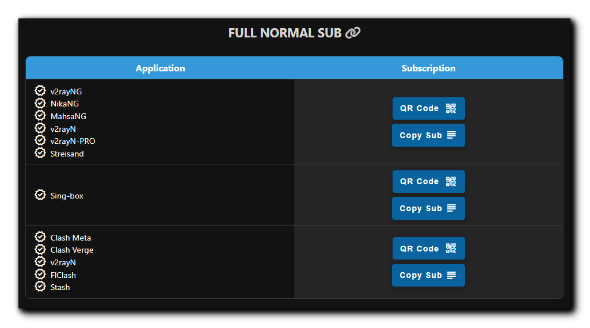
</p>

این ساب کانفیگای بالایی رو میده با این تفاوت که تمام تنظیمات قست VLESS / Trojan پنل روش اعمال میشه که میتونید [اینجا](#تنظیمات-vlesstrojan) یاد بگیرید، همینطور این ساب‌ها کانفیگ **Best Ping** دارن (توضیح در ادامه). با اعمال تنظیمات routing تا حدود 90% تبلیغات ایرانی و خارجی رو بلاک میکنه، سایت‌های ایرانی و چینی رو دور میزنه (نیاز به خاموش کردن VPN برای درگاه پرداخت و ... نیست)، LAN رو دور میزنه، پورن و QUIC رو مسدود میکنه و همینطور ساب Sing-box محتواهای Phishing و Malware و ... رو تا حد خوبی مسدود میکنه.
> [!TIP]
> کانفیگ **Best Ping** چیه؟ این کانفیگ اومده همه‌ی کانفیگای پنل رو ادغام کرده و هر 30 ثانیه چک میکنه کدوم کانفیگ سرعت بهتری داره به اون وصل میشه! اگر ip تمیز وارد کرده باشید یا پروتکل تروجان فعال کنید یا پورتای دیگه انتخاب کنید، اونم داخل Best Ping اضافه میشه. این نوع کانفیگ رو توی ساب‌های Fragment و Warp هم در ادامه داریم.
<br><br>

## سابسکریپشن Fragment <a id="سابسکریپشن-fragment"></a>

<p align="center">
  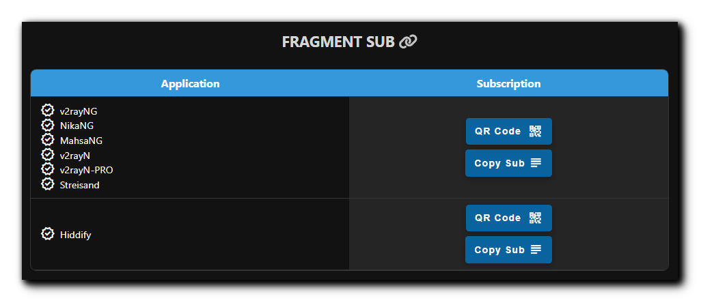
</p>

> [!NOTE]
> **خواص کانفیگای Fragment**
> 
> 1- اتصال حتی در صورت فیلتر شدن دامنه‌ی شخصی یا ورکر
> 
> 2- بهبود کیفیت و سرعت روی همه‌ی اپراتورا مخصوصا اونایی که اختلال دارن روی کلادفلر

<br>


### سابسکریپشن Fragment برای Xray <a id="سابسکریپشن-fragment-برای-xray"></a>

منظور برنامه‌هایی هستن که از هسته‌ی Xray استفاده میکنن، در اصل ردیف اول جدول FRAGMENT SUB در پنل، وارد کردنش داخل اپ هم مثل ساب معمولیه. کانفیگ‌های این قسمت یه `F` تو اسمشون دارن.

این ساب همون تعداد کانفیگ که تو ساب Full Normal داشتید رو با فرگمنت بهتون میده (با تنظیمات فرگمنتی که توی پنل اعمال کردید) به اضافه‌ی کانفیگ **Best Fragment** و **Workerless**. شما هر تنظیماتی که داخل پنل انجام بدید وقتی ساب رو آپدیت کنید روی همه‌ی کانفیگا اعمال میشه.

> [!TIP]
> کانفیگ WorkerLess بدون ورکر خیلی از سایت‌ها و اپلیکیشن‌های فیلتر شده رو باز میکنه! مثل یوتیوب، توییتر، Google Play و سایت‌های فیلتر شده‌ی دیگه که اینجا جا نمیشه. حواستون باشه که این کانفیگ چون از ورکر استفاده نمیکنه IP شما رو تغییر نمیده بنابراین برای کارهای امنیتی مناسب نیست. تغییراتی که برای فرگمنت در پنل اعمال میکنید روی این کانفیگ هم اعمال میشه بجز Chain Proxy.

> [!TIP]
> کانفیگ Best Fragment میاد `22` مقدار مختلف فرگمنت رو اعمال میکنه و هر کدوم سرعت بیشتری داشته باشن رو بر اساس اپراتور شما انتخاب مبکنه! این 22 حالت جوری انتخاب شده که هیچ بازه‌ای از قلم نیافته و کانفیگ تمام بازه‌های کوچیک و بزرگ رو هر 1 دقیقه تست کنه و به بهترینش وصل بشه. 
تنظیمات پیشرفته مربوط به فرگمنت هم [اینجا](#تنظیمات-fragment) توضیح داده شده.
<br><br>

### سابسکریپشن Fragment برای Hiddify <a id="سابسکریپشن-fragment-برای-hiddify"></a>

ردیف دوم جدول FRAGMENT SUB برای استفاده‌ی فرگمنت روی برنامه‌ی Hiddify هست، با یک تفاوت. بخاطر محدودیت‌های این برنامه خیلی از تنظیمات پنل روی این ساب اعمال نمیشه، در اصل خود برنامه بازنویسی میکنه این تنظیمات رو. کانفیگ‌های این قسمت یه `F` تو اسمشون دارن. تنظیمات زیر رو باید دستی در برنامه Hiddify اعمال کنید و در حال حاضر از پنل اعمال نمیشن:

 1. Remote DNS
 2. Local DNS
 3. Fragment Packets
 4. Routing

> [!CAUTION]
> 1- حتما Remote DNS رو از تنظیمات برنامه تغییر بدید به یک DOH مثل:
> `https://8.8.8.8/dns-query` یا `https://94.140.14.14/dns-query`
> در صورتی که از ...//:udp یا IP خالی این قسمت استفاده کنید ورکرتون کار نمیکنه.
> 
> 2- اگر در برنامه دستی Fragment رو روشن کرده باشید تنظیمات فرگمنت پنل اعمال نمیشه.

البته یه راه دیگه هم هست و اونم اینکه ساب نرمال رو وارد برنامه Hiddify بکنید و مثل عکس زیر فرگمنت رو خودتون فعال کنید:
<p align="center">
  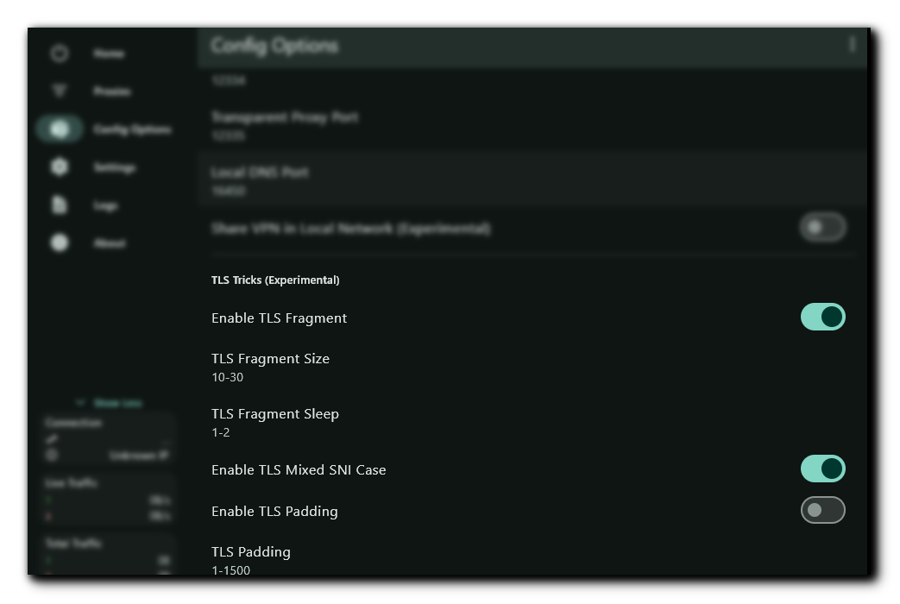
</p>
<br><br>

## سابسکریپشن Warp <a id="سابسکریپشن-warp"></a>

<p align="center">
  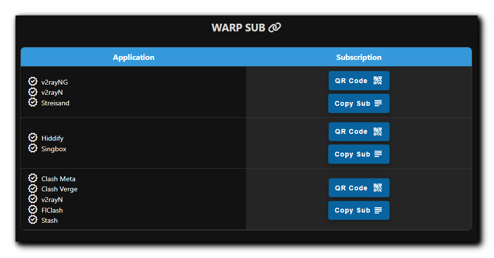
</p>

این ساب‌ یه کانفیگ Warp میده که IP کلادفلر ایران هست و یه کانفیگ Warp on Warp (به اختضار WoW) که IP خارجه (در حال حاضر بدلیل تغییرات کلادفلر بعضی وقتا IP ایران میده) و یه کافیگ Warp Best Ping که میاد به سریعترین کانفیگ Warp وصل میشه و همیشه IP ایران داره و یه کانفیگ WoW Best Ping که به سریعترین کانفیگ WoW وصل میشه که IP خارجه. بصورت پبشفرض یه کانفیگ Warp و WoW بیشتر نیست ولی اگر قسمت Endpoints رو ویرایش کنید به تعداد Endpoint های ورودی کانفیگ Warp و WoW اضافه میشه.

در نظر داشته باشید حتما از اسکنر استفاده کنید برای پیدا کردن Endpoint مناسب روی اپراتور خودتون. اسکریپت اسکنر داخل پنل هست، کپی کنید و داخل Termux روی اندروید اجراش کنید. برای قرار دادن داخل پنل قسمت تنظیمات پیشرفته 7-4 رو بخونید. ساب وارپ معمولی ممکنه روی یه سری اپراتور مثل ایرانسل خوب کار کنه ولی برای بقیه از ساب Warp Pro استفاده کنید.
<br><br>
## سابسکریپشن Warp PRO <a id="سابسکریپشن-warp-pro"></a>

<p align="center">
  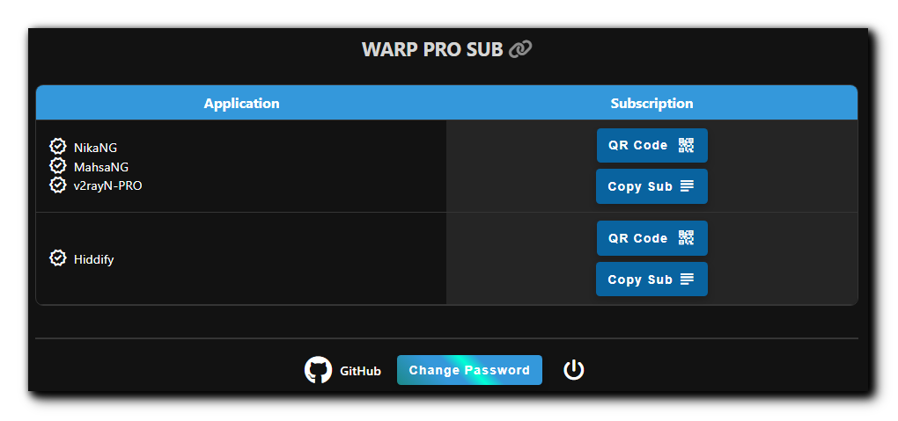
</p>

توسعه‌های جدیدی رو هسته‌های Xray و Singbox توسط GFW-Knocker و تیم Hiddify برای وارپ صورت گرفته که خروجیش شده برنامه‌های MahsaNG، NikaNG، v2rayN-PRO و Hiddify که این امکان رو به ما داده برای شرایط ایران اتصال به وارپ رو بهینه کنیم، مشابه کاری که بچه‌ها روی Oblivion انجام میدن. بنابراین WARP PRO SUB رو به پنل اضافه کردم که از قسمت تنظیمات WARP PRO SETTINGS میشه شخصی‌سازی کرد. مقادیر بهینه برای هر اپراتور بصرت تجربی بدست میاد که مثل تنظیمات فرگمنت ممکنه در زمان‌های مختلف هم فرق داشته باشن، اما مقادیر پیشفرض تست شدن و در حال حاضر خوب کار مکنن، صرفا باید Endpoint مناسب بذارید.

> [!CAUTION]
> اپ Hiddify هم باید حداقل ورژنش 2.0.5 باشه.
<br><br>

## تنظیمات پیشرفته <a id="تنظیمات-پیشرفته"></a>

اول بگم اگر هر تغییر اشتباهی دادید نگران نباشید، بغل دکمه APPLY SETTINGS یه دکمه RESET گذاشتم که پنل رو به تنظیمات پیشفرض برمیگردونه.
<br><br>

## تنظیمات VLESS/TROJAN <a id="تنظیمات-vlesstrojan"></a>

<p align="center">
  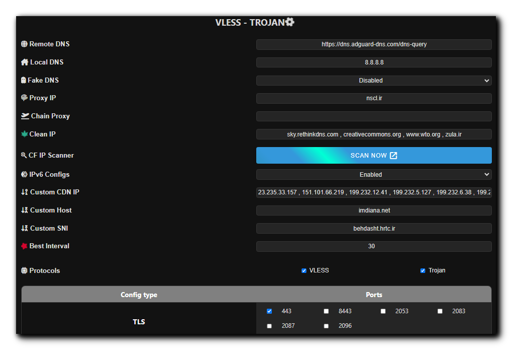
</p>

این قسمت برای تنظیمات کانفیگای Fragment و ساب‌های Clash و Singbox هست و تاثیری روی کانفیگ‌های بخش نرمال v2ray و همچنین ساب‌های وارپ نداره.

### سرورهای DNS <a id="سرورهای-dns"></a>

بطور پیشفرض من Google DOH رو گذاشتم برای Remote DNS و Google DNS رو گذاشتم برای Local DNS. یعنی تو کانفیگ پیشفرض اینه:

> `Remote DNS: https://8.8.8.8/dns-query`
>
> `Local DNS: 8.8.8.8`

> [!CAUTION]
> به هیچ عنوان از `https://1.1.1.1/dns-query` یا `https://cloudflare-dns.com/dns-query` برای remote DNS استفاده نکنید چون پینگ رو بالا میبره و کانکشن ناپایدار میشه.

> [!TIP]
> از ورژن 2.5.5 به بعد میتونید از DOH یا DOT های رسمی استفاده کنید و مطمئن باشید که بهترین عملکرد رو دارن، برای مثال چندتا رو اینجا میذارم:
>
> `https://dns.google/dns-query`
>
> `https://cloudflare-dns.com/dns-query`
>
> `https://dns.adguard-dns.com/dns-query`
>
> `https://freedns.controld.com/p2`
>
> `https://dns.quad9.net/dns-query`
>
> `https://security.cloudflare-dns.com/dns-query`
>
> `tls://dns.google`

میتونید Fake DNS رو هم فعال کنید، به سرعت DNS کمک میکنه ولی حواستون باشه ممکنه با بعضی برنامه‌ها سازگار نباشه و یا DNS سیستم رو درگیر کنه، بنابراین اگر نمیدونید دقیقا چیه ترجیحا فعالش نکنید.
<br><br>

### تنظیمات ProxyIP <a id="تنظیمات-proxyip"></a>

برای تغییر Proxy IP از ورژن 2.3.5 به بعد میتونید از طریق خود پنل انجام بدید، به این ترتیب که اعمال میکنید و ساب رو آپدیت میکنید و تمام. اما توصیه میکنم از روش قدیمی داشبورد کلادفلر انجام بدید چون:

> [!CAUTION]
> اگر از طریق پنل Proxy IP رو اعمال کنید و اون IP از کار بیافته، باید یه IP جایگزین کنید و ساب رو آپدیت کنید. معنیش اینه که اگر کانفیگ اهدا کرده باشید و Proxy IP رو تغییر بدید دیگه فایده‌ای نداره چون یوزر ساب نداره که کانفیگ رو آپدیت کنه. بنابراین توصیه میشه از این روش فقط برای مصرف شخصی استفاده کنید. اما خوبی روش قدیمی اینه که نیازی به آپدیت کردن کانفیگ‌ها نداره.

برای مثال میتونید از لینک‌های زیر Proxy IP انتخاب کنید، یه تعدادی IP نشون میده که میتونید کشورشون رو هم چک کنید و یه دونه انتخاب کنید، اولی مخزن آی‌پی خودمونه یه تعدادی پروکسی آی‌پی روتین گذاشته میشه و وسطای صفحه چند سطر توضیح نوشتم برای نحوه پیدا کردن پروکسی‌آی‌پی، پیشنهاد میکنم از آی‌پی تکی استفاده‌ نکنید. همچنین دومی و سومی اینا رو باز کنید یه تعدادی IP نشون میده که میتونید کشورشون رو هم چک کنید و یه دونه انتخاب کنید:

>[All about proxyIP](https://github.com/NiREvil/vless/blob/main/sub/ProxyIP.md)
>
>[Find proxyIP](https://www.nslookup.io/domains/ipdb.rr.nu/dns-records/)
>
>[Find proxyIP](https://www.nslookup.io/domains/bpb.yousef.isegaro.com/dns-records/)

<br>

> [!CAUTION]
> > حتما بعد از اعمال ساب رو آپدیت کنید.
> 
<br>


و یا میتونید مستقیما از داخل کد اونو تغییر بدید
لاین `4100` فایل وورکر یعنی دقیقا [از این لاین](https://github.com/NiREvil/bia-pain-bache/blob/4bfd8adb08653198dcd2398e1b6aca8bf5a35c1f/_worker.js#L4100) اونو تغییر بدین. مثلا ب این شکل:

```css
var proxyIPs = ["bpb.radicalization.ir"];
```
در نهایت Commit changes بزنید تا ذخیره بشه.

یا میتونید از [این آموزش](https://github.com/bia-pain-bache/BPB-Worker-Panel/blob/main/docs/proxy-ip-scanner.md) برای خودتون اسکن کنید. البته در حال حاضر ممکنه اسکنر خوب جواب نده، میتونید امتحان کنید.
<br><br>

### تنظیمات Chain Proxy <a id="تنظیمات-chain-proxy"></a>

قبلا گفتیم که میشه یه دونه Proxy IP گذاشت و IP رو برای سایت‌های پشت کلادفلر ثابت کرد، اما کماکان وقتی سایتای معمولی رو باز میکنیم IP ما متعلق به ورکر هست که اینم هر چند وقت یک بار عوض میشه. برای اینکه کلا برای همه‌ی سایت‌ها IP رو فیکس کنیم این قسمت اضافه شده. میتونیم یه کانفیگ VLESS یا Socks یا Http رایگان که حتی فیلتر هم شده باشه (بشرطی که فقط تو ایران فیلتر شده باشه ولی کار کنه) این قسمت بذاریم و IP ما برای همیشه ثابت میشه به IP این کانفیگ.
   
> [!CAUTION]
> 1- این کانفیگ نباید خودش ورکر باشه وگرنه بازم IP نهاییتون تغییر میکنه.
>
> 2- برای دریافت کانفیگ رایگان منبع زیاده، من سایت [racevpn.com](https://racevpn.com) رو توصیه میکنم که البته محدودیت زمانی داره، بر اساس کشور میتونید کانفیگ بگیرید. از کانفیگای [IRCF](https://ircfspace.github.io/tconfig/) و یا بات تلگرامی [ی ب خ](https://t.me/TheTVCbot) هم میتونید استفاده کنید ولی ممکنه بعضی از کانفیگاشون از کار افتاده باشه.
> 
> 3- کانفیگ VLESS میتونه یکی از انواع زیر باشه:
> 
> `Reality TCP`
> 
> `Reality GRPC`
> 
> `Reality WS`
> 
> `Reality TCP Header`
> 
> `WS TLS`
> 
> `GRPC TLS`
> 
> `TCP TLS`
> 
> `WS`
> 
> `GRPC`
> 
> `TCP`
> 
> `TCP Header`
>
> 5- کانفیگ Socks میتونه یکی از اشکال زیر باشه:
>
> socks://`address`:`port`
>
> socks://`user`:`pass`@`address`:`port`
>
> 6- کانفیگ Http میتونه یکی از اشکال زیر باشه:
>
> http://`address`:`port`
>
> http://`user`:`pass`@`address`:`port`
> 
> 7- این بخش فقط روی تمام ساب‌ها به جز ردیف اول جدول Normal و ساب‌های Warp اعمال میشه، بعد از اعمال حتما ساب رو آپدیت کنید. ولی ساب نرمال اون کانفیگ رو بصورت تکی بهتون میده. مثلا میتونید تو برنامه‌ی Nekobox یا Husi در قسمت Group ساب خودتون رو ویرایش کنید و این کانفیگ رو بعنوان Landing Proxy قرار بدید، اینجوری ساب Chain میشه. جدیدا برنامه v2rayNG هم از ورژن 1.9.1 این قابلیت رو اضافه کرده، باید اسم کانفیگ رو کپی کنید، برید Subscription group setting سابتون رو ویرایش کنید و اسم رو در قسمت `Next proxy remarks` جاگذاری کنید.

> [!IMPORTANT]
> 1- گر از کانفیگ VLESS TLS برای Chain استفاده میکنید حتما باید پورتش 443 باشه وگرنه پنل بهتون اجازه نمیده.
> 
> 2- کانفیگ‌های VLESS که برای alpn مقدار randomized دارن روی Clash کار نمیکن چون ساپورت نمیکنه.
>
> 3- کانفیگ VLESS WS برای Chain کردن روی Sing-box مناسب نیست، باگ داره.
<br><br>

### تنظیمات IP تمیز <a id="تنظیمات-ip-تمیز"></a>

لینک های اشتراک نرمال (بدون فرگمنت) 6 تا کانفیگ بهتون میده. اینجا میتونید تعداد کانفیگها رو زیاد کنید.

> [!TIP]
> روی اپراتورهایی که از IPv6 پشتیبانی میکنن (مثل رایتل، ایرانسل و آسیاتک) اول IPv6 رو روی سیمکارت فعال کنید، بعد داخل تنظیمات V2RayNG گزینه‌ی Prefer IPv6 رو فعال کنید و از بین این 6 تا کانفیگ هم از اون دو تا آخری یا اونی که آدرسش دامنه‌ خودتون هست استفاده کنید. به طور کلی همیشه یه بار Real delay all configuration بزنید و با هر کدوم بهتر بود وصل بشید.


اون 6 تا کانفیگ پیشفرضی که پنل میده همشون IP تمیز هستن، در ضمن اگر از کانفیگای Fragment استفاده کنید دیگه خیلی IP تمیز اهمیتی نداره، اما بعضی اپراتورا مثل مخابرات روی کانفیگای معمولی هنوز IP تمیز میخوان.

خب حالا اگر خواستید علاوه بر اون 6 تا کانفیگ دیگه ای اضافه کنید که با IP تمیز خودتون باشه، مطابق عکس IP یا دامین‌های تمیز خودتون رو با ویرگول وارد کنید و Apply بزنید، اسکنر آنلاین بچه‌های [IRCF](https://ircf.space) رو هم اضافه کردم:

<p align="center">
  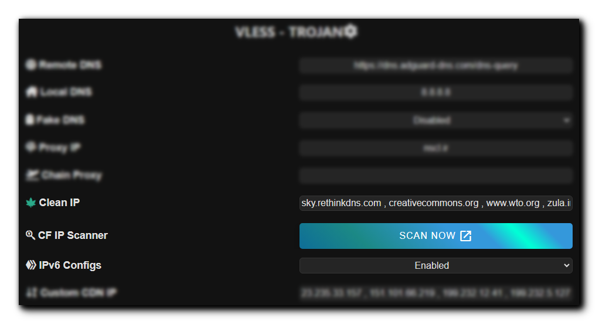
</p>

الان اگر توی اپلیکیشن Update subscription بزنید میبینید که کانفیگای جدید اضافه شدن.

در ضمن این کانفیگای جدید همزمان به قسمت فرگمنت هم اضافه میشن.

<br>

> [!CAUTION]
> حتما بعد از اعمال ساب رو آپدیت کنید.
<br><br>

### فعال کردن IPv6 <a id="فعال-کردن-ipv6"></a>

پنل بطور پیشفرض کانفیگ‌های IPv6 هم میده، ولی اگر اپراتورتون پشتیبانی نمیکنه، برای خلوت شدن کانفیگا میتونید غیرفعالش کنید.
<br><br>

### تنظیمات Custom CDN <a id="تنظیمات-custom-cdn"></a>

3 تا فیلد داریم به اسم Custom CDN، برای مواقعی استفاده میشه که شما میاید دامنه‌ی Worker خودتون رو میبرید پشت یه CDN دیگه، مثلا Fastly یا Gcore یا هر CDN دیگه‌ای. این 3 قسمت به ترتیب عبارتند از:

1- بخش `Custom Addr` که در اصل حکم همون IP ها یا IP تمیزهای کلادفلر رو داره. ولی از هر CDN که اینجا استفاده میکنید باید IP های خودشو بذارید، نمیشه IP کلادفلرو بذارید برای Fastly یا Gcore. اینجام مثل IP تمیز که داشتیم میتونید دامنه، IP ورژن 4 یا 6 با ویرگول بذارید، حواستون باشه IPv6 باید بین [ ] باشه مثل:
> speedtest.net , [2a04:4e42:200::731] , 151.101.66.219

2- بخش `Custom Host` باید host که توی اون CDN تعریف کردید و اشاره میکنه به ورکر خودتون رو بذارید. مثلا توی Fastly میشه یه آدرس دامنه فیک تعریف کرد.

3- بخش `Custom SNI` هم میتونید اون دامنه‌ی فیک رو بذارید هم یه سایتی که روی همون CDN باشه. مثلا سایت speedtest.net (بدون wwww) روی CDN Fastly هست.

حالا بعد از تنظیم کردن این بخش، کانفیگاش به ساب‌های Normal اضافه میشه، همه‌ی ساب‌های Sing-box و Clash و v2ray و .... اسم این کانفیگ‌ها یه `C` داره توش که با بقیه قاطی نشه.

> [!IMPORTANT]
> در حال حاضر فقط کانفیگ‌های پورت 443 و 80 با این متد متصل میشن.

> [!TIP]
> این کانفیگ‌ها روی ساب Normal و Full Normal میان. ولی اگر از ساب Normal استفاده میکنید باید دستی از تنظیمات کانفیگ Allow Insecure رو فعال کنید. Full Normal خودش اعمال میکنه.
<br><br>

### زمان چک کردن Best Ping <a id="زمان-چک-کردن-best-ping"></a>

تو همه‌ی ساب‌های Fragment یا Sing-box و Clash ما Best Ping رو داریم. بصورت پیشفرض هر 30 ثانیه میومد بهترین کانفیگ یا مقدار Fragment رو پیدا میکرد و بهش وصل میشد، اما ممکنه اگه سرعت نت خوب نباشه و شما در حال تماشای ویدئو یا بازی کردن باشید این 30 ثانیه دردسرساز بشه و تجربه‌ی Lag داشته باشید. از اینجا میتونید زمان رو تنظیم کنید، حداقل میتونه 10 ثانیه باشه و حداکثر 90.
<br><br>

### انتخاب Protocol <a id="انتخاب-protocol"></a>

میتونید یکی یا هر دو پروتکل VLESS و Trojan رو فعال کنید.
> [!CAUTION]
> این دو پروتکل بر بستر کلادفلر اتصال UDP رو به خوبی پشتیبانی نمیکنن، بنابراین برای مثال تماس صوتی تلگرام کار نمیکنه. همچنین نمیتونید از DNS های UDP بعنوان remote DNS استفاده کنید، اگر در برنامه‌ای دیدید remote DNS یه IP مثل 1.1.1.1 هست یا یه همچین چیزی udp://1.1.1.1 به مشکل بر میخورید. حتما از فرمت‌های زیر استفاده کنید:
> این دو پروتکل بر بستر کلادفلر اتصال UDP رو به خوبی پشتیبانی نمیکنن، بنابراین برای مثال تماس صوتی تلگرام کار نمیکنه. همچنین نمیتونید از DNS های UDP بعنوان remote DNS استفاده کنید، اگر در برنامه‌ای دیدید remote DNS یه IP مثل 1.1.1.1 هست یا یه همچین چیزی udp://1.1.1.1 به مشکل بر میخورید. حتما از فرمت‌های زیر استفاده کنید:
>
> `https://IP/dns-query` مثل `https://8.8.8.8/dns-query` , `https://94.140.14.14/dns-query` , `https://208.67.222.222/dns-query` and ...
> 
> `https://doh/dns-query` مثل `https://dns.google/dns-query` , `https://dns.quad9.net/dns-query` , `https://doh.opendns.com/dns-query` and ...
> 
> `tcp://IP` مثل `tcp://8.8.8.8` , `tcp://94.140.14.14` , `tcp://185.228.168.9` and ...
> 
> `tls://IP` مثل `tls://dns.google` , `tls://cloudflare-dns.com` , `uncensored.freedns.controld.com` and ...

<br>

### انتخاب Port <a id="انتخاب-port"></a>

از این بخش میتونید پورت‌های مورد نیازتون رو انتخاب کنید. یه نعدادیشون بهتون کانفیگ TLS میدن که امن‌تره ولی وقتایی که روی TLS و Fragment اختلال ایجاد میشه این کانفیگا وصل میشن.
> [!CAUTION]
> دقت کنید برای استفاده از کانفیگ‌های non TLS باید از روش Workers دپلوی کرده باشید. در غیر این صورت Port های http در پنل نمایش داده نمیشن چون با روش Pages کار نمیکنن.

> [!TIP]
> کانفیگ‌های non TLS فقط به ساب نرمال اضافه میشن.
<br><br>

## تنظیمات Fragment <a id="تنظیمات-fragment"></a> 

<p align="center">
  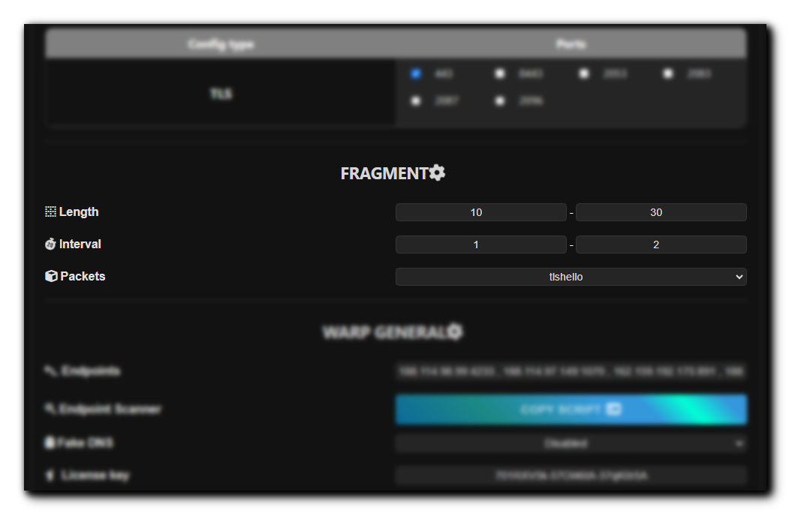
</p>

بصورت پیشفرض:
   
>`Length: 10-30`
>
>`Interval: 1-2`
>
>`Packets: tlshello`

خب حالا میتونید پارامترا رو تنظیم کنید و Apply رو بزنید. اینجوری کانفیگای فرگمنت با تنظیمات شما ارائه میشن.


> [!NOTE]
> میتونید یکی از پارامترا رو عوض کنید یا همشو با هم. هر تغییری که بدید ذخیره میشه و دفعه بعد نیازی به تنظیم از اول نیست.

> [!IMPORTANT]
> مقادیر فرگمنت حداکثر دارن، Length بیشتر از 8000 نمیتونه باشه، Interval بیشتر از 30.
<br>

> [!IMPORTANT]
> مقدار 1-1 در بخش Packets فقط روی برنامه‌های MahsaNG و NikaNG و v2rayN-PRO کار میکنه.
> 
<br><br>

## تنظیمات WARP GENERAL <a id="تنظیمات-warp-general"></a>

<p align="center">
  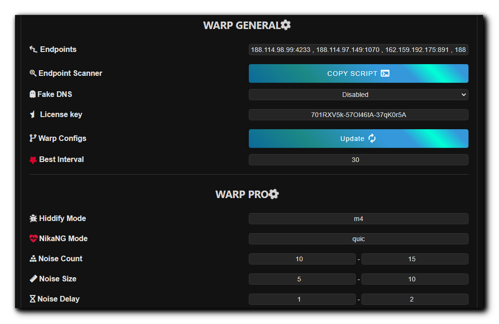
</p>

بین هر دو ساب Warp و Warp Pro مشترکه و روی جفتشون اعمال میشه که دو تا قسمت اصلی داره:

1. یه Endpoints داریم که اینا برای Warp حکم IP تمیز برای VLESS رو دارن. هم برای کانفیگای Warp اعمال میشه هم WoW. یه اسکریپت اسکنر هم گذاشتم که روی Termux اندروید یا روی لینوکس میتونید اجراش کنید و بذارید توی پنل، البته 100 درصدی نیست و باید تست کنید دیگه.

> [!CAUTION]
> دقت کنید وارد کردن Endpoint به صورت IP:Port یا Domain:port هست و باید بینشون ویرگول باشه.
> 
> برای وارد کردن IPv6 باید داخل [] قرارش بدید. به مثال زیر دقت کنید:
> 
> 123.45.8.6:1701 , engage.cloudflareclient:2408 , [2a06:98c1:3120::3]:939

2. میتونید Fake DNS رو برای کانفیگای Warp هم جداگونه فعال کنید، به سرعت DNS کمک میکنه ولی حواستون باشه ممکنه با بعضی برنامه‌ها سازگار نباشه و یا DNS سیستم رو درگیر کنه، بنابراین اگر نمیدونید دقیقا چیه ترجیحا فعالش نکنید.
3. قسمت Warp+ License شما میتونید یه لایسنس وارپ پلاس اعمال کنید و کانفیگاتون رو به پلاس ارتقا بدید که سرعت بهتری دارن. وقتی وارد کردید اول باید Apply کنید تا ذخیره بشه بعد از قسمت تنظیمات وارپ Update رو بزنید. از [اینجا](https://ircfspace.github.io/warpplus/) یا از این [بات تلگرامی](https://t.me/generatewarpplusbot) یا از این [کانال تلگرامی](https://t.me/warpplus) یه لایسنس Warp Plus بگیرید. اما حواستون باشه که هر لایسنس فقط برای 5 تا کانقیگ وارپ استفاده میشه و هر بار که شما ازش توی پنل استفاده کنید 2 بارش مصرف میشه. بعبارت دیگه اگر لایسنس شما مصرف نشده باشه و بذارید داخل پنل، دو بار میتونید Update رو بزنید و کانفیگاتون تبدیل به پلاس میشه، بعدش ارور میده که Too many connected device.

> [!CAUTION]
> اگر از کانال تلگرامی یا سایت اولی متعلق به IRCF لایسنس رو بگیرید، چون عمومی هستن ممکنه همون اول بگه Too many connected devices. ولی اون بات تلگرامی هرچی بده جدیده فقط یه سری مراحلی داره که بتونید از بات استفاده کنید.
   
> [!TIP]
> اگر لایسنس Warp+ نداشته باشید و Update کنید میاد همون کانفیگای معمولی جدیدو بروزرسانی میکنه اما اگر داشته باشید میاد تبدیل به کانفیگای Warp Plus میکنه.

> [!TIP]
> بعد از اینکه لایسنس رو Apply کردید و کانفیگای وارپ رو Update کردید و ساب وارپ رو Update کردید و وصل شدید برای اینکه چک کنید واقعا Plus شده یا نه [این لینک](https://cloudflare.com/cdn-cgi/trace) رو باز کنید، اون آخراش باید نوشته باشه warp=plus.

4. قسمت Warp Configs اینجوریه که اگه Update کنید میره کانفیگای وارپ جدید از کلادفلر میگیره و ذخیره میکنه، اگه ساب‌ها رو آپدیت کنید میبینید که تغییر کردن. ولی این قسمت اصلا ربطی به سرعت اتصال نداره.
<br>

5. زمان چک کردن Best Ping. تو ساب‌های Warp و Warp PRO ما Best Ping رو داریم. بصورت پیشفرض هر 30 ثانیه میومد بهترین کانفیگ یا Endpoint رو پیدا میکرد و بهش وصل میشد، اما ممکنه اگه سرعت نت خوب نباشه و شما در حال تماشای ویدئو یا بازی کردن باشید این 30 ثانیه دردسرساز بشه و تجربه‌ی Lag داشته باشید. از اینجا میتونید زمان رو تنظیم کنید، حداقل میتونه 10 ثانیه باشه و حداکثر 90.
<br><br>

## تنظیمات WARP PRO <a id="تنظیمات-warp-pro"></a>

<p align="center">
  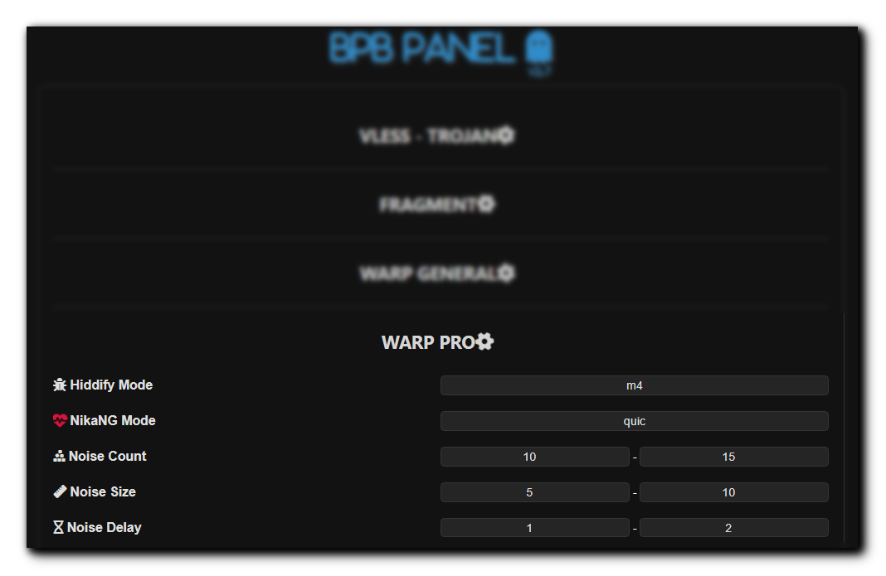
</p>

فقط برای ساب WARP PRO هست که بالاتر توضیح دادم چیه. چند قسمت داره:

1. اولی Hiddify Noise Mode هست که تعیین میکنه روی چه مودی نویزها (پکت‌های فیک) تولید بشن. هسته‌ی Singbox تیم Hiddify این حالتا رو پشتیبانی میکنه:
   
- مودهای m1 تا m6
- مود h_HEX که اون HEX میتونه بین 00 تا FF باشه، مثلا h_0a , h_f9 و h_9c و ...
- مود g_HEX_HEX_HEX که بازم اون HEX مثل بالاس مثلا g_0a_ff_9c
  
2. دومی NikaNG Noise Mode هست که این حالتا رو داره:

- مود none یعنی هیچ نویزی اعمال نشه، در اصل میشه همون کانفیگای نرمال وارپ.
- مود quic که خود تیم سازنده برای شرایط ایران توصیه کرده.
- مود random که میاد بصورت تصادفی Noise تولید میکنه.
- و مود آخر که میتونید خودتون یه رشته‌ی HEX دلبخواه استفاده کنید، مثلا fe09ad5600bc...
  
3. بخش Noise Count تعداد این پکت‌های فیک یا نویز هست که ارسال میشه. مثلا پیشفرض پنل میگه بین 10 الی 15 تا بفرست.
4. بعدی Noise size هست که از اسمش مشخصه طول این پکت‌هاست.
5. آخری Noise Delay هم فاصله‌ی بین ارسال این نویزها هست.

این تنظیمات به مرور برای هر اپراتور با آزمون و خطاها مشخص میشه.
<br><br>

## تنظیمات Routing Rules <a id="تنظیمات-routing-rules"></a>

<p align="center">
  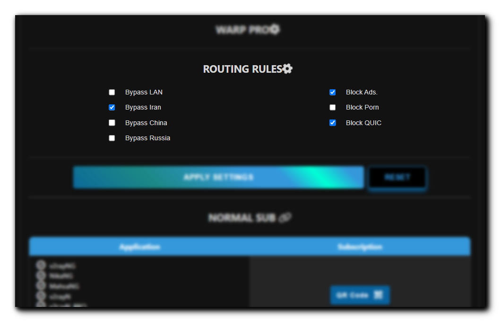
</p>

این قسمت برای اینه که کانفیگ‌ها (به جز اونایی که ساب Normal میده) بتونن:
1. اتصال مستقیم LAN داشته باشن. مثلا دسترسی به 127.0.0.1 یا 192.168.1.1 مستقیم میشه.
2. به سایت‌های ایرانی مستقیم بدون VPN وصل بشن (برای بازدید از بعضی سایت‌ها مخصوصا درگاه پرداخت نیازی به قطع کردن نباشه)
3. دسترسی مستقیم به سایت‌های چینی داشته باشن.
4. به سایت‌های روسی دسترسی مستقیم داشته باشن.
5. تبلیغات ایرانی و خارجی تا حدود 80 درصد مسدود کنن.
6. سایت‌های پورن رو مسدود کنن.
7. اتصالات QUIC رو مسدود کنن (بخاطر ناپایدار بودن شبکه)

در حالت عادی این قسمت غیر فعال شده، چون باید اول مطمئن بشید Geo asset برنامه‌تون آپدیته.
> [!CAUTION]
> اگر فعال کردید و VPN متصل نشد تنها دلیلش آپدیت نبودن Geo asset هست. از منوی برنامه‌ی v2rayNG وارد قسمت Geo asset files بشید و اون علامت ابر یا دانلود رو بزنید تا آپدیت بشن، اگر آپدیت ناموفق باشه وصل نمیشید. اگر هر کاری کردید آپدیت نشد دو تا فایل از دو تا لینک زیر دانلود کنید و بجای آپدیت زدن، دکمه اضافه کردن رو بزنید و این دوتا فایل رو وارد کنید:
> 
>[geoip.dat](https://github.com/Loyalsoldier/v2ray-rules-dat/releases/latest/download/geoip.dat)
> 
>[geosite.dat](https://github.com/Loyalsoldier/v2ray-rules-dat/releases/latest/download/geosite.dat)
>

<br>

<p align="center">
  <br>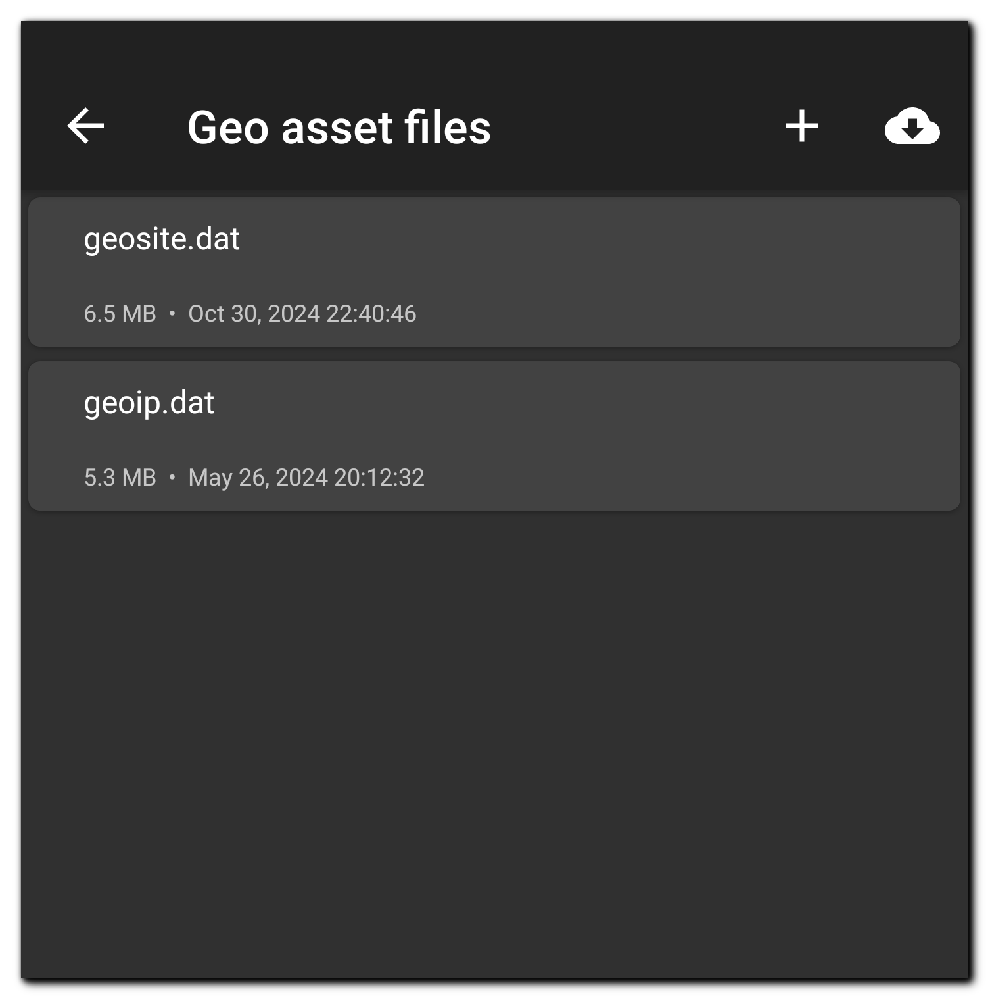
</p>
