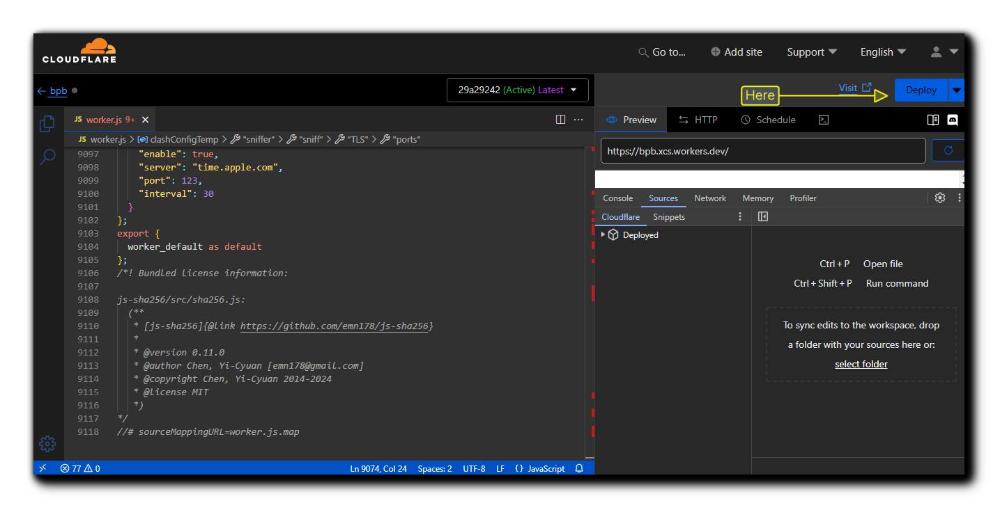
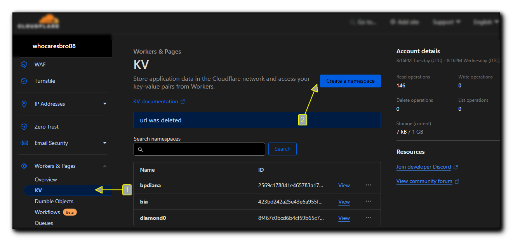
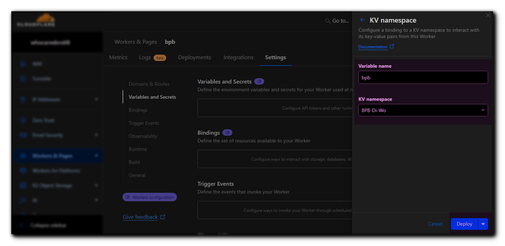
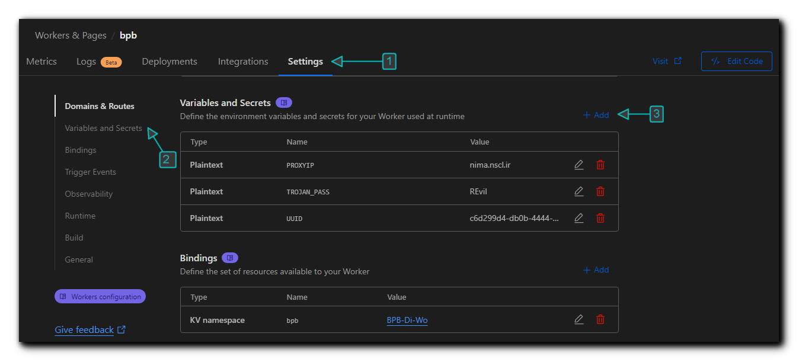
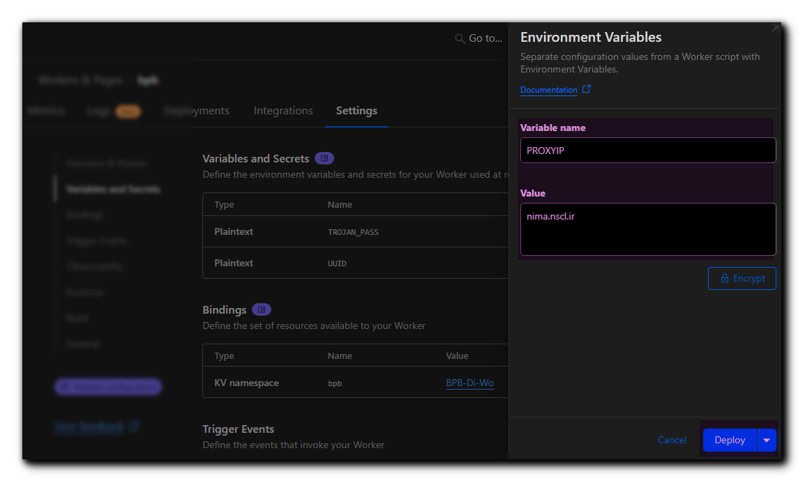
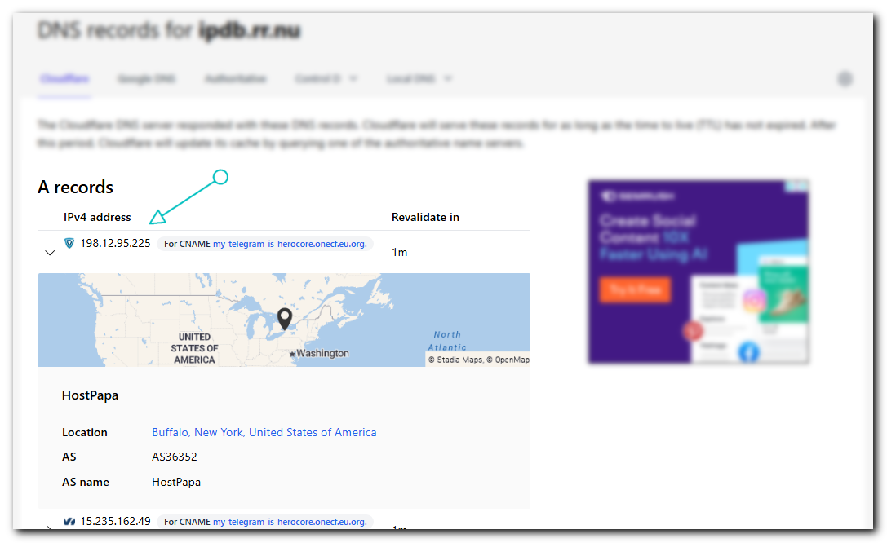

<h1 align="center">$$\color{#a5a5a5} \Huge \text{ Cloudflare Workers نصب از طریق}$$ </h1>

<p align="center">
  <br>


<h3>$$\color{#a5a5a5} \Large \text{خب بعد از ساخت یک وورکر }$$</h3>

و وارد شدن به قسمت Edit codes: سپس کد Worker رو از [اینجا](https://github.com/NiREvil/bia-pain-bache/blob/main/_worker.js) دانلود کنید و ببرید توی داشبورد ورکر کلادفلرو فایل رو آپلود کنید (چون کد خیلی زیاد شده Copy Paste کردن با گوشی خیلی سخت شده، با توجه به عکس زیر آپلود کنید). توی مویایل منوی کناری رو باز کنید و تاچ کنید روش نگه دارید و آپلود کنید.

<p align="center">
  
</p>

پنل با UUID و Proxy IP و پسوردهای Trojan پیشفرض خودش کار میکنه و میتونید ادامه بدید، ولی اگر خواستید تغییر بدید به بخش [تنظیمات پیشرفته](#تنظیمات-پیشرفته-اختیاری) برید و برگردید اینجا.

 در نهایت ورکر رو `Save and Deploy` کنید.
حالا از اینجا به داشبورد ورکر برگردید و این مراحل را دنبال کنید:

<p align="center">
  
</p>

از این قسمت وارد صفحه `KV` بشید:

<p align="center">
  
</p>

تو قسمت KV بزنید `Create a namespace` و یه اسم دلخواه وارد کنید مثلا Test و `Add` کنید.

دوباره از منوی سمت چپ به قسمت `Workers & Pages` برید، ورکری که ساختید رو باز کنید، برید به قسمت `Settings` و `Bindings` رو پیدا کنید. `Add` بزنید و `KV Namespace` رو انتخاب کنید،  مطابق تصویر زیر از کشویی پایینی اون KV که ساخته بودید انتخاب کنید (در مثال Test بود). چیزی که مهمه کشویی بالاییه، حتما باید مقدارش رو بذارید `bpb` و `Save` و تمام.

<p align="center">
  
</p>

برای مثال، فرض کنید دامنه‌ی ورکر شما هست worker-polished-leaf-d022.workers.dev، یه `panel/` تهش اضافه کنید و وارد پنل بشید. مثال:

>`https://worker-polished-leaf-d022.workers.dev/panel`

ازتون میخواد پسورد جدید بذارید و لاگین کنید و تمام.
نصب به پایان رسیده و توضیحاتی که در ادامه اومده شاید برای عموم لازم نباشه.
آموزشهای تنظیمات و نکات هم که توی [آموزش اصلی](configuration_fa.md) هست.
<br><br>
##  تنظیمات پیشرفته (اختیاری)
شاید تا الان متوجه شده باشید که در مورد تغییر UUID و Proxy IP و پسورد Trojan چیزی نگفتیم چون میتونید از پیشفرض خود پنل استفاده کنید. اما برای تغییرشون میتونید مراحل زیر رو دنبال کنید، توصیه میشه حداقل UUID و پسوردهای Trojan رو تغییر بدید. 

### 1- تغییر UUID
همونطور که میدونید UUID  مثل اسم رمزی میمونه که داخل لینک‌های اشتراک و کانفیگ ها قرار میگیره و شما در صورت نیاز میتونید تغییر بدید. در صورت تغییر این پارامتر اتصال کاربرهای شما قطع میشه و لازم هست لینک اشتراک و یا کانفیگ ها رو مجددا در اختیارشون قرار بدید. در صورتی که این UUID رو در این مرحله تعریف نکنید هم کد از یک UUID پیشفرض استفاده خواهد کرد.

تو لاین `4095` کد یه UUID هست و میتونید تغییرش ندید ولی ترجیحا اینجوری عوضش کنید: از [اینجا](https://www.uuidgenerator.net/) یه UUID بگیرید و کپی کنید تو لاین 4095 جای قبلی و تمام. ورکر رو Save and Deploy کنید.


### 2- ثابت کردن Proxy IP


ما یه مشکلی داریم که این کد به صورت پیشفرض از تعداد زیادی IP Proxy استفاده میکنه که برای هر بار اتصال به سایتای پشت کلادفلر ( شامل بخش وسیعی از وب میشه) به صورت رندوم IP جدیدی انتخاب میکنه و در نتیجه به صورت متناوب IP شما تغییر پیدا میکنه. این تغییر IP شاید برای برخی مشکل ساز باشه (مخصوصا تریدرها). برای تغییر Proxy IP از ورژن 2.3.5 به بعد میتونید از طریق خود پنل انجام بدید، به این ترتیب که اعمال میکنید و ساب رو آپدیت میکنید و تمام. اما توصیه میکنم از روشی که در ادامه توضیح دادم استفاده کنید چون:

> [!CAUTION]
> اگر از طریق پنل Proxy IP رو اعمال کنید و اون IP از کار بیافته، باید یه IP جایگزین کنید و ساب رو آپدیت کنید. معنیش اینه که اگر کانفیگ اهدا کرده باشید و Proxy IP رو تغییر بدید دیگه فایده‌ای نداره چون یوزر ساب نداره که کانفیگ رو آپدیت کنه. بنابراین توصیه میشه از این روش فقط برای مصرف شخصی استفاده کنید. اما خوبی روش دوم که در ادامه میگم اینه که از طریق داشبورد کلادفلر انجام میشه و نیازی به آپدیت کردن کانفیگ‌ها نداره.
<br><br>

### 3- تغییر پسورد Trojan

پروتکل Trojan با پسورد پیشفرض خودش کار میکنه ولی با توجه به اینکه تعداد زیادی از این پنل استفاده میکنن، توصیه میکنم حتما این پسورد عوض بشه.

<br>

برای تغییر UUID و Proxy IP و پسورد Trojan از منوی سمت چپ به قسمت `Workers & Pages` برید، ورکری که ساختید رو باز کنید، برید به قسمت `Settings` و `Variables and Secrets` رو پیدا کنید:

<p align="center">
  
</p>

اینجا باید مقادیر رو مشخص کنید. هر بار `Add` میزنید و یه کدوم رو وارد میکنید و `Deploy` میکنید:

<p align="center">
  
</p>


یه بار `Add variable` بزنید و خونه اول رو بنویسید `UUID` با حروف بزرگ، بعد از [اینجا](https://www.uuidgenerator.net/) یه UUID بگیرید و بذارید خونه دوم.

حالا یه بار دیگه `Add variable` بزنید خونه اول `PROXYIP` با حروف بزرگ، IP رو هم میتونید از [«این مخزن»](https://github.com/NiREvil/vless/blob/main/sub/ProxyIP.md) پروکسی آی‌پی مناسب خودتون رو پیدا کنید و یا مستقیم تو لینک‌های زیر جستجو کنید.
لینکهای رو باز کنید (داخل کد ورکر خط `4098` و `4099` هم گذاشتم) یه تعدادی IP نشون میده که میتونید کشورشون رو هم چک کنید و یه دونه انتخاب کنید، اولی مخزن آی‌پی خودمونه یه تعدادی پروکسی آی‌پی روتین گذاشته میشه و وسطای صفحه چند سطر توضیح نوشتم برای نحوه پیدا کردن پروکسی‌آی‌پی، پیشنهاد میکنم از آی‌پی تکی استفاده‌ نکنید. همچنین دومی و سومی اینا رو باز کنید یه تعدادی IP نشون میده که میتونید کشورشون رو هم چک کنید و یه دونه انتخاب کنید:

>[All about proxyIP](https://github.com/NiREvil/vless/blob/main/sub/ProxyIP.md)
>
>[Find proxyIP](https://www.nslookup.io/domains/ipdb.rr.nu/dns-records/)
>
>[Find proxyIP](https://www.nslookup.io/domains/bpb.yousef.isegaro.com/dns-records/)

<p align="center">
  
</p>


لاین `4100` فایل وورکر یعنی دقیقا [از این لاین](https://github.com/NiREvil/bia-pain-bache/blob/4bfd8adb08653198dcd2398e1b6aca8bf5a35c1f/_worker.js#L4100) اونو تغییر بدین. مثلا ب این شکل:

```javascript
var proxyIPs = ["bpb.radicalization.ir"];
```

بعد که خواستید IP رو بذارید این شکلی میشه:
```javascript
var proxyIPs = ["43.153.103.203"];
```

ورکر رو `Save and Deploy` کنید.
> [!WARNING]
> فقط حواستون باشه تعداد این IP ها زیاده و ممکنه تعداد زیادیشون از کار افتاده باشن. باید تست کنید تا یه خوبشو سوا کنید.

> [!CAUTION]
> اگر از تک IP استفاده کنید احتمالا بعد یه مدت دوباره از کار میافته و خیلی سایتا باز نمیشن. باید از اول این مراحلو برید.


یه بار دیگه `Add variable` بزنید خونه اول `TROJAN_PASS` با حروف بزرگ، یه پسورد دلخواه بذارید.
<br><br>

## 4- اتصال دامنه به Workers:

برای این کار به داشبورد کلادفلر میرید و از قسمت `Workers and Pages` ورکر خودتون رو انتخاب میکنید. به قسمت `Settings` میرید و همون اول `Domains & Routes` رو میبینید، `Add +` رو میزنید و `Custom domain` رو انتخاب میکنید. اینجا ازتون میخواد یه Domain وارد کنید (دقت کنید قبلا باید یه دامنه خریداری کرده باشید و روی همین اکانت فعال کرده باشید که اینجا جای آموزشش نیست). حالا فرض کنید یه دامنه دارید به اسم bpb.com، در قسمت Domain میتونید خود دامنه یا یک زیردامنه دلخواه بزنید. مثلا xyz.bpb.com . بعد هم `Add domain` رو میزنید. کلادفلر خودش میره ورکر رو به دامنه‌ی شما متصل میکنه (یه مدت طول میکشه تا این اتفاق بیافته، خود کلادفلر میگه ممکنه تا 24 ساعت طول بکشه).
بعد باید دوباره `Add +` رو بزنید و این بار `Route` رو بزنید، قسمت Zone که دامنه خودتون رو انتخاب میکنید و در قسمت Route باید اینجوری دامنه جدید رو وارد کنید: 
> `*bpb.com/*`

خب بعد از این میتونید از آدرس `https://xyz.bpb.com/panel` وارد پنلتون بشید و ساب‌های جدید رو دریافت کنید.

> [!TIP]
> 1- اگر به ورکر دامنه وصل کنید مثل Pages ترافیکش نامحدود میشه.
> 
> 2- خود ورکر پورت‌های nonTLS مثل `80` و `8080` و ... رو ساپورت میکنه و توی پنل نشون میده، اما اگر دامنه متصل بشه دیگه این پورت‌ها کار نمیکنن و پنل هم نشون نمیده.
